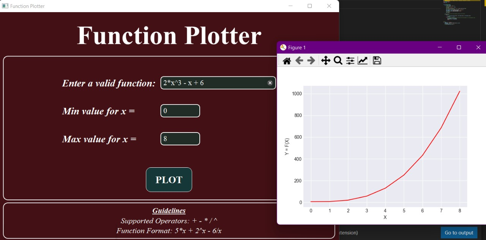

# Function Plotter

 
 

## 💻 Built With
 <ul>
  <li><a href="https://www.python.org/">Python</a></li>
  <li><a href="https://build-system.fman.io/pyqt5-tutorial">PyQt5</a></li>
  <li><a href="https://docs.python.org/3/library/unittest.html">Unittest</a></li>
  <li><a href="https://matplotlib.org/">Matplotlib</a></li>
 </ul>

## 📙 About

GUI program that plots arbitrary user-entered function 

## 📝 Description
* Take a function of x from the user, e.g., 5*x^3 + 2*x. 
* Take min and max values of x from the user. 
* The following operators are supported: + - / * ^.

## 🏁 Getting Started
<blockquote>
  
This is a list of needed instructions to set up your project locally, to get a local copy up and running follow these instructuins.
 

</blockquote>
<h3 href="#installation">Installation</h3>
<ol>
  <li><strong><em>Clone the repository</em></strong>
    <blockquote>$ git clone https://github.com/abdelrahman0123/Function-Plotter</blockquote>
  </li>
  <li> 
  <strong><em>Navigate to repository directory
</em></strong>
    <blockquote>$ cd Function-Plotter</blockquote>
  </li>
  <li> 
  <strong><em>Install dependencies
</em></strong>
    <blockquote>$ python -m pip install -U matplotlib</blockquote>
 <blockquote>$ pip install PyQt5</blockquote>
  </li>
</ol>
<h3 href="#Running">Running</h3>
<ol>
  <li><strong><em>Run the Function Plotter </em></strong>
       <blockquote>$ python app.py </blockquote>
  </li>
</blockquote>
  </li>
 
</ol>

<h2 href="#structure">File Structure</h2>
 
 
  <pre>
Function-Plotter
├── screenshots
├── Design.ui
├── Graph.py
├── LICENSE
├── README.md
├── Screen.py
├── ShowMsg.py
├── Validation.py
├── app.py
  </pre>

### Screenshots

#### Main Screen

#### Graphs

#### Error messages

## Contributors

<table>
<tr>
<td align="center">
<a href="https://github.com/abdelrahman0123" target="_blank">
 <b>Abdelrahman Hamdy</b></a> 
</td>
</tr>
 </table>

## License

This project is licensed under the [MIT] License - see the [LICENSE.md](LICENSE) file for details
